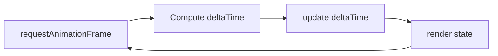
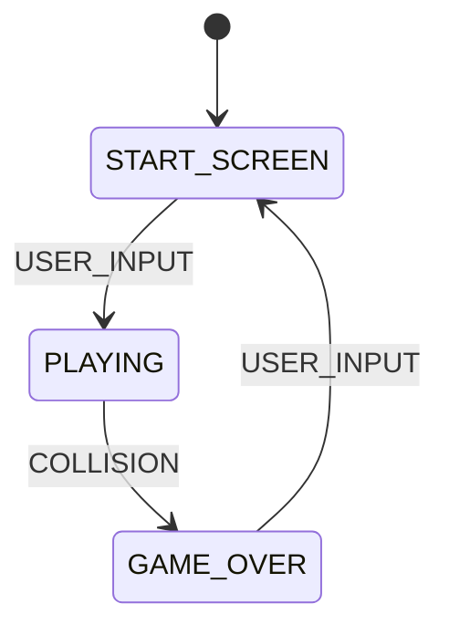

# Design Document: Flappy Kiro Foundation

## Overview

This design establishes the foundational scaffold for the Flappy Kiro browser game. The scaffold delivers three files (`index.html`, `style.css`, `app.js`) that implement:

- A single-page architecture with no external dependencies
- An HTML5 Canvas 2D rendering surface with DOM UI overlays
- A dark retro visual theme (`#1a1a2e` background, neon purple/green accents)
- An explicit state machine (START_SCREEN → PLAYING → GAME_OVER)
- A `requestAnimationFrame` game loop with delta time computation
- Pure render functions for geometric entities (Ghosty, Pipes, Data Packets)
- Procedural Web Audio API placeholder functions
- AABB collision detection as an isolated pure function
- Input handlers for keyboard (Spacebar) and mouse (click)

The scaffold does NOT implement full gameplay. It provides the structural skeleton that subsequent specs build upon.

## Architecture

### High-Level Structure

```
index.html
├── <link> → style.css
├── <canvas id="game-canvas">
├── <div id="start-overlay">
├── <div id="score-overlay">
├── <div id="gameover-overlay">
└── <script defer> → app.js

style.css
├── Reset & dark background
├── Canvas centering
└── Overlay absolute positioning + styling

app.js
├── Constants (UPPER_SNAKE_CASE, grouped at top)
├── State machine (transitionState)
├── Entity render functions (pure)
├── Collision detection (pure)
├── Audio placeholder functions
├── Input handlers
├── Update function
├── Render function
└── Game loop (requestAnimationFrame)
```

### Frame Cycle



Each frame follows a strict two-phase cycle:
1. **Update phase** — All state mutations (position, velocity, collisions, state transitions) complete
2. **Render phase** — Canvas is cleared, background filled, entities drawn, overlays toggled

No draw calls occur during update. No state mutations occur during render.

### State Machine



The `transitionState(currentState, event)` function is pure — it returns the next state without side effects. Invalid state/event pairs return the current state unchanged.

## Components and Interfaces

### index.html

| Element | ID / Selector | Purpose |
|---------|--------------|---------|
| `<canvas>` | `game-canvas` | 2D rendering surface for game world |
| `<div>` | `start-overlay` | Title + "Press Space to start" text |
| `<div>` | `score-overlay` | Live score + high score display |
| `<div>` | `gameover-overlay` | Final score + restart instruction |

### style.css

| Responsibility | Approach |
|---------------|----------|
| Page background | `body { background: #1a1a2e; margin: 0; padding: 0; }` |
| Canvas centering | Flexbox on body or wrapper to center horizontally/vertically |
| Overlay positioning | `position: absolute` over canvas, `z-index` above canvas, `pointer-events: none` |
| Typography | Monospace font, `color: #e0e0e0` or lighter |

### app.js — Function Signatures

```javascript
// === Constants (grouped at top) ===
const CANVAS_WIDTH = 400;        // pixels
const CANVAS_HEIGHT = 600;       // pixels
const GRAVITY = 980;             // px/s²
const TERMINAL_VELOCITY = 500;   // px/s
const FLAP_IMPULSE = -300;       // px/s (negative = upward)

// === State Machine ===
function transitionState(currentState, event) → nextState

// === Entity Rendering (pure) ===
function renderGhosty(ctx, ghosty) → void
function renderPipePair(ctx, pipe) → void
function renderDataPacket(ctx, packet) → void

// === Collision Detection (pure) ===
function rectsOverlap(a, b) → boolean

// === Audio Placeholders ===
function playJumpSound() → void
function playScoreSound() → void
function playCrashSound() → void
function playPowerUpSound() → void

// === Game Loop ===
function update(dt) → void
function render() → void
function gameLoop(timestamp) → void

// === Input ===
// keydown listener on document (Spacebar)
// click listener on canvas
```

### Function Purity Contract

| Function | Pure? | Inputs | Output |
|----------|-------|--------|--------|
| `transitionState` | ✅ | (state, event) | next state |
| `renderGhosty` | ✅ | (ctx, ghosty) | draws to ctx |
| `renderPipePair` | ✅ | (ctx, pipe) | draws to ctx |
| `renderDataPacket` | ✅ | (ctx, packet) | draws to ctx |
| `rectsOverlap` | ✅ | (rectA, rectB) | boolean |
| `update` | ❌ | (dt) | mutates game state |
| `render` | ❌* | () | reads state, draws | 
| `gameLoop` | ❌ | (timestamp) | orchestrates frame |

*`render` reads mutable game state but does not mutate it.

## Data Models

### Game State Object

```javascript
const GAME_STATES = {
  START_SCREEN: 'START_SCREEN',
  PLAYING: 'PLAYING',
  GAME_OVER: 'GAME_OVER'
};

const EVENTS = {
  USER_INPUT: 'USER_INPUT',
  COLLISION: 'COLLISION'
};
```

### Entity State Shapes

```javascript
// Ghosty (player character)
let ghosty = {
  x: Number,       // horizontal position (fixed)
  y: Number,       // vertical position
  width: Number,   // bounding box width
  height: Number,  // bounding box height
  velocity: Number // vertical velocity (px/s, positive = down)
};

// Pipe Pair
// (placeholder shape for render demo — not fully populated until gameplay spec)
let pipe = {
  x: Number,          // horizontal position
  gapY: Number,       // center Y of the gap
  gapHeight: Number,  // height of the gap opening
  width: Number       // pipe width
};

// Data Packet
let dataPacket = {
  x: Number,      // center X
  y: Number,      // center Y
  radius: Number  // circle radius
};
```

### Collision Rectangle Shape (for AABB)

```javascript
// Used by rectsOverlap(a, b)
// Each rect: { x, y, width, height }
```

### Delta Time Computation

```javascript
let previousTimestamp = null;

function gameLoop(timestamp) {
  let dt = previousTimestamp ? (timestamp - previousTimestamp) / 1000 : 0;
  dt = Math.min(dt, 0.1); // Clamp to prevent instability
  previousTimestamp = timestamp;
  
  update(dt);
  render();
  requestAnimationFrame(gameLoop);
}
```


## Correctness Properties

*A property is a characteristic or behavior that should hold true across all valid executions of a system — essentially, a formal statement about what the system should do. Properties serve as the bridge between human-readable specifications and machine-verifiable correctness guarantees.*

### Property 1: State transition purity

*For any* valid Game_State and any event string, calling `transitionState(state, event)` shall return a valid Game_State without modifying the `state` argument or any variable outside its scope.

**Validates: Requirements 5.2, 11.2**

### Property 2: State transition identity on invalid input

*For any* (state, event) pair that does not match a defined transition rule (START_SCREEN+USER_INPUT, PLAYING+COLLISION, GAME_OVER+USER_INPUT), `transitionState(state, event)` shall return a value strictly equal to the input state.

**Validates: Requirements 5.7**

### Property 3: Delta time bounds

*For any* pair of `requestAnimationFrame` timestamps (previous, current) where current ≥ previous ≥ 0, the computed delta time shall always be in the range [0, 0.1] seconds.

**Validates: Requirements 6.2**

### Property 4: Render function purity

*For any* entity state object (ghosty, pipe, or data packet) with arbitrary numeric position/dimension values, calling the corresponding render function with a canvas 2D context and that entity state shall leave the entity state object deeply equal to its value before the call.

**Validates: Requirements 8.1, 8.2, 8.3, 11.1**

### Property 5: Sound placeholder safety

*For any* sound placeholder function (playJumpSound, playScoreSound, playCrashSound, playPowerUpSound), invoking it shall never throw an exception regardless of whether the Web Audio API is available in the runtime environment.

**Validates: Requirements 9.6**

### Property 6: Collision detection commutativity

*For any* two rectangles A and B (each defined by x, y, width, height with width > 0 and height > 0), `rectsOverlap(A, B)` shall equal `rectsOverlap(B, A)`.

**Validates: Requirements 11.3**

### Property 7: Collision detection self-overlap

*For any* rectangle R with width > 0 and height > 0, `rectsOverlap(R, R)` shall return `true`.

**Validates: Requirements 11.3**

## Error Handling

### Asset Load Failures

- When `assets/ghosty.png` fails to load (404, network error, or corrupt file), the game renders Ghosty as a purple circle/rounded rectangle using Canvas 2D primitives. The `Image.onerror` handler sets a flag that the render function checks.
- No error is thrown to the console for asset failures. The game continues silently with geometric fallbacks.

### Web Audio API Unavailability

- All sound placeholder functions wrap their `AudioContext` / `OscillatorNode` / `GainNode` creation in `try/catch` blocks.
- If the browser blocks audio (autoplay policy) or the API is unavailable, the catch block silently swallows the error.
- The game continues without audio — sound is non-critical to gameplay.

### Delta Time Spikes

- If the browser tab is backgrounded and returns after a long pause, the timestamp gap could be several seconds.
- Delta time is clamped to a maximum of 0.1 seconds (`Math.min(dt, 0.1)`) to prevent entities from teleporting or physics from exploding.
- First-frame edge case: when no previous timestamp exists, dt is set to 0 so no movement occurs on the initial frame.

### Invalid State Transitions

- `transitionState` handles unknown state/event combinations by returning the current state unchanged.
- No error is thrown for invalid transitions — the system remains in its current state.

### Canvas Context Acquisition

- `getContext('2d')` is called exactly once at initialization. If it returns `null` (extremely unlikely in modern browsers), the game does not attempt to render. No crash occurs, but no visual output is produced.

## Testing Strategy

### Dual Testing Approach

This feature uses both **unit tests** (example-based) and **property-based tests** to achieve comprehensive coverage.

### Property-Based Testing

**Library:** [fast-check](https://github.com/dubzzz/fast-check) (JavaScript property-based testing)

**Configuration:**
- Minimum 100 iterations per property test
- Each test tagged with: `Feature: flappy-kiro-foundation, Property {N}: {description}`

**Properties to implement:**

| # | Property | Generator Strategy |
|---|----------|-------------------|
| 1 | State transition purity | Arbitraries for 3 valid states + arbitrary event strings |
| 2 | State transition identity | Arbitraries for all state/event combos excluding 3 valid transitions |
| 3 | Delta time bounds | Arbitrary positive floats for timestamp pairs |
| 4 | Render function purity | Arbitrary objects with numeric x, y, width, height, velocity fields |
| 5 | Sound placeholder safety | Each of 4 functions called with mocked/absent AudioContext |
| 6 | Collision commutativity | Arbitrary rect pairs (positive width/height) |
| 7 | Collision self-overlap | Arbitrary single rect (positive width/height) |

### Unit Tests (Example-Based)

Focus areas for unit tests:

- **State machine transitions** (5.3–5.6): Verify each valid transition produces the correct next state
- **Overlay visibility** (3.5–3.7): For each state, verify correct overlay shown/hidden
- **Input handling** (10.1–10.5): Simulate keydown/click events and verify correct actions per state
- **Render call ordering** (8.4, 8.5): Verify clearRect → fillRect(background) → entity draws sequence
- **Game loop structure** (6.4): Verify update called before render with correct dt
- **Physics constants** (7.1–7.4): Verify existence, signage, and grouping of constants
- **Canvas setup** (2.1–2.3): Verify canvas element, context acquisition, dimension constants

### Integration Tests

- **Browser load test**: Open `index.html` in a headless browser, verify no console errors, verify canvas renders
- **Asset fallback test**: Remove `assets/ghosty.png`, verify geometric fallback renders without errors

### What Is NOT Property Tested

- HTML structure and CSS styling (static analysis / example tests)
- Event listener registration (example tests with mocks)
- Function line count limits (static analysis / linting)
- requestAnimationFrame usage (example test with mock)
