# Design Document: Game Enhancements

## Overview

This design extends the existing Flappy Kiro single-page application with 16 enhancements spanning gameplay, visual/audio, technical quality, and distribution. All additions maintain the vanilla JavaScript single-file architecture (`app.js`), HTML5 Canvas 2D rendering, Web Audio API audio, and the established state machine pattern.

The design introduces:
- **Gameplay layer**: Online leaderboard via Firebase, three new power-ups (Shield, Slow-Motion, Magnet), endless mode visual variations (Day/Night cycle, Themed Worlds)
- **Visual/Audio layer**: Ghosty trail effect, pipe color gradient, procedural chiptune music, death animation
- **Technical quality layer**: Mobile responsive canvas, accessibility improvements, object pooling, PWA support
- **Distribution layer**: GitHub Pages deployment workflow, README documentation

All new systems integrate into the existing `update(deltaMs)` → `render()` frame cycle, extend the `gameContext` object, and follow the pure-function-where-possible pattern established in the codebase.

## Architecture

### High-Level System Diagram

```mermaid
graph TD
    subgraph "Input Layer"
        KB[Keyboard Events]
        TC[Touch Events]
        CL[Click Events]
    end

    subgraph "Game Loop (requestAnimationFrame)"
        UPD[update deltaMs]
        RND[render ctx gameContext]
    end

    subgraph "Core Systems (Existing)"
        SM[State Machine]
        PHY[Physics Engine]
        PIPE[Pipe System]
        COLL[Collision Detection]
        SCORE[Scoring System]
        STEER[Steering Mode]
        PART[Particle System]
        AUDIO[Procedural Audio]
        PARA[Parallax Background]
    end

    subgraph "New Gameplay Systems"
        LB[Leaderboard Service]
        SHIELD[Shield Power-Up]
        SLOW[Slow-Motion Power-Up]
        MAGNET[Magnet Power-Up]
        DN[Day/Night Cycle]
        THEME[Themed Worlds]
    end

    subgraph "New Visual/Audio Systems"
        TRAIL[Trail Effect]
        PGRAD[Pipe Gradient]
        MUSIC[Chiptune Music]
        DEATH[Death Animation]
    end

    subgraph "New Technical Systems"
        RESP[Responsive Canvas]
        A11Y[Accessibility]
        POOL[Object Pool]
        PWA[PWA / Service Worker]
    end

    subgraph "External Services"
        FB[Firebase Realtime DB]
        GH[GitHub Pages]
    end

    KB --> UPD
    TC --> UPD
    CL --> UPD
    UPD --> SM
    UPD --> PHY
    UPD --> PIPE
    UPD --> COLL
    UPD --> SCORE
    UPD --> STEER
    UPD --> SHIELD
    UPD --> SLOW
    UPD --> MAGNET
    UPD --> DN
    UPD --> THEME
    UPD --> TRAIL
    UPD --> DEATH
    UPD --> POOL
    RND --> PARA
    RND --> PGRAD
    RND --> TRAIL
    RND --> MUSIC
    LB --> FB
    PWA --> GH
```



### Integration Strategy

Each new system follows the established pattern:
1. **Constants** declared at the top of `app.js` in UPPER_SNAKE_CASE
2. **Pure functions** for state computation (return new state, no side effects)
3. **Update integration** via calls within the existing `update(deltaMs)` function
4. **Render integration** via calls within the existing `render()` function
5. **DOM elements** for UI overlays managed separately from canvas rendering

### State Machine Extension

The existing state machine (`START_SCREEN`, `PLAYING`, `PAUSED`, `GAME_OVER`) remains unchanged. New systems hook into state transitions via event callbacks rather than modifying `transitionState()`:

- `PLAYING` → `GAME_OVER`: Triggers death animation, leaderboard submission, music stop
- `GAME_OVER` → `START_SCREEN`: Resets power-ups, theme, trail buffer, pools
- `START_SCREEN` → `PLAYING`: Starts music, initializes day/night cycle, activates responsive scaling

## Components and Interfaces

### 1. Leaderboard Service (`leaderboardService`)

```javascript
// Firebase configuration and initialization
const FIREBASE_CONFIG = { /* project credentials */ };
const LEADERBOARD_TIMEOUT = 5000; // ms
const MAX_LEADERBOARD_ENTRIES = 10;
const DISPLAY_NAME_KEY = 'flappyKiroDisplayName';

// Interface
function initLeaderboard(config) → void
function submitScore(displayName, score) → Promise<void>
function fetchTopScores(limit) → Promise<LeaderboardEntry[]>
function getStoredDisplayName() → string | null
function saveDisplayName(name) → void
function isValidDisplayName(name) → boolean  // 3-15 alphanumeric chars
```

### 2. Shield Power-Up System

```javascript
// Constants
const SHIELD_RADIUS = 14;
const SHIELD_SPAWN_CHANCE = 0.10;
const SHIELD_DURATION = 5000; // ms
const SHIELD_OUTLINE_OFFSET = 6; // px beyond sprite diagonal

// Interface
function spawnShieldPickup(pipe) → ShieldPickup | null
function moveShieldPickup(pickup, speed, dt) → ShieldPickup
function checkShieldPickupCollision(playerRect, pickup) → boolean
function activateShield(gameContext) → gameContext
function updateShield(gameContext, deltaMs) → gameContext
function absorbCollision(gameContext) → gameContext
function renderShieldPickup(ctx, pickup) → void
function renderShieldEffect(ctx, player, spriteWidth, spriteHeight) → void
```

### 3. Slow-Motion Power-Up System

```javascript
// Constants
const SLOW_MOTION_RADIUS = 12;
const SLOW_MOTION_SPAWN_CHANCE = 0.08;
const SLOW_MOTION_DURATION = 4000; // ms
const SLOW_MOTION_MULTIPLIER = 0.5;
const SLOW_MOTION_RAMP_DURATION = 500; // ms linear ramp-up on expiry

// Interface
function spawnSlowMotionPickup(pipe) → SlowMotionPickup | null
function moveSlowMotionPickup(pickup, speed, dt) → SlowMotionPickup
function checkSlowMotionCollision(playerRect, pickup) → boolean
function activateSlowMotion(gameContext) → gameContext
function updateSlowMotion(gameContext, deltaMs) → gameContext
function getEffectiveSpeedMultiplier(gameContext) → number  // 0.5..1.0
function renderSlowMotionPickup(ctx, pickup) → void
function renderSlowMotionOverlay(ctx, canvasWidth, canvasHeight) → void
```

### 4. Magnet Power-Up System

```javascript
// Constants
const MAGNET_RADIUS = 14;
const MAGNET_SPAWN_CHANCE = 0.08;
const MAGNET_DURATION = 6000; // ms
const MAGNET_ATTRACT_RADIUS = 150; // px
const MAGNET_ATTRACT_SPEED = 3; // px/frame at 60fps, scaled by dt

// Interface
function spawnMagnetPickup(pipe) → MagnetPickup | null
function moveMagnetPickup(pickup, speed, dt) → MagnetPickup
function checkMagnetCollision(playerRect, pickup) → boolean
function activateMagnet(gameContext) → gameContext
function updateMagnet(gameContext, deltaMs) → gameContext
function attractDataPackets(packets, playerCenter, dt) → DataPacket[]
function renderMagnetPickup(ctx, pickup) → void
function renderMagnetRing(ctx, playerCenter, elapsedMs) → void
```

### 5. Day/Night Cycle System

```javascript
// Constants
const DAY_NIGHT_PERIOD = 60000; // ms (60 seconds full cycle)
const NIGHT_COLOR = { r: 26, g: 26, b: 46 };  // #1a1a2e
const DAY_COLOR = { r: 46, g: 58, b: 90 };    // #2e3a5a
const STAR_OPACITY_MIN = 0.2;
const STAR_OPACITY_MAX = 0.8;

// Interface
function initDayNightCycle() → DayNightState
function updateDayNightCycle(state, deltaMs, isPaused) → DayNightState
function getCyclePosition(state) → number  // 0.0 (night) to 1.0 (day)
function interpolateBackground(cyclePosition) → string  // hex color
function getStarOpacity(cyclePosition) → number
```

### 6. Themed Worlds System

```javascript
// Constants
const THEME_INTERVAL = 50; // score interval for theme change
const THEME_TRANSITION_DURATION = 300; // ms fade
const WORLD_THEMES = [
  { pipe: '#00d400', accent: '#1a1a2e', particle: '#a020f0' },  // Default
  { pipe: '#00bcd4', accent: '#1a2e2e', particle: '#00e5ff' },  // Cyan
  { pipe: '#ff9800', accent: '#2e1a1a', particle: '#ffeb3b' },  // Amber
  { pipe: '#e91e63', accent: '#2e1a2e', particle: '#f48fb1' },  // Pink
];

// Interface
function initThemeSystem() → ThemeState
function updateThemeSystem(state, score, deltaMs) → ThemeState
function getCurrentTheme(state) → WorldTheme
function getThemeTransitionAlpha(state) → number  // 0.0..1.0 for fade overlay
function renderThemeTransition(ctx, alpha, canvasWidth, canvasHeight) → void
```

### 7. Responsive Canvas System

```javascript
// Constants
const BASE_WIDTH = 400;
const BASE_HEIGHT = 600;
const ASPECT_RATIO = 2 / 3;
const MIN_CANVAS_WIDTH = 280;
const MAX_CANVAS_WIDTH = 600;
const PADDING_HORIZONTAL = 16;
const PADDING_VERTICAL = 16;
const RESIZE_DEBOUNCE_MS = 100;

// Interface
function calculateCanvasDimensions(viewportWidth, viewportHeight) → { width, height }
function getScaleFactor(currentWidth) → number  // currentWidth / BASE_WIDTH
function applyCanvasResize(canvas, width, height) → void
function setupResizeHandler(canvas, onResize) → void
```

### 8. Trail Effect System

```javascript
// Constants
const TRAIL_BUFFER_SIZE = 12;
const TRAIL_SAMPLE_INTERVAL = 2; // frames between samples
const TRAIL_COLOR = '#a855f7';
const TRAIL_MAX_RADIUS = 10;
const TRAIL_MIN_RADIUS = 3;

// Interface
function initTrailBuffer() → RingBuffer
function sampleTrailPosition(buffer, x, y) → RingBuffer
function renderTrail(ctx, buffer) → void
function clearTrailBuffer(buffer) → RingBuffer
```

### 9. Pipe Gradient System

```javascript
// Constants
const PIPE_COLOR_START = { r: 0, g: 212, b: 0 };    // #00d400 green
const PIPE_COLOR_END = { r: 212, g: 0, b: 0 };      // #d40000 red

// Interface
function calculatePipeColorFactor(currentSpeed, baseSpeed, maxSpeed) → number  // [0,1]
function interpolatePipeColor(factor) → string  // hex color
```

### 10. Chiptune Music System

```javascript
// Constants
const MUSIC_NOTE_DURATION = 200; // ms per note
const MUSIC_VOLUME = 0.15;
const PENTATONIC_SCALE = [261.6, 293.7, 329.6, 392.0, 440.0, 523.3, 587.3, 659.3]; // C4 pentatonic extended
const MUSIC_FADE_OUT = 100; // ms

// Interface
function createChiptuneEngine(audioContext) → MusicEngine
function startMusic(engine) → void
function stopMusic(engine) → void
function pauseMusic(engine) → void
function resumeMusic(engine) → void
```

### 11. Death Animation System

```javascript
// Constants
const DEATH_ANIM_DURATION = 800; // ms
const DEATH_SPIN_RATE = 360; // degrees per second
const DEATH_RECAP_FADE_IN = 400; // ms

// Interface
function initDeathAnimation(player, velocity) → DeathAnimState
function updateDeathAnimation(state, deltaMs) → DeathAnimState
function isDeathAnimationComplete(state) → boolean
function getDeathAnimPosition(state) → { y, rotation }
```

### 12. Accessibility System

```javascript
// Interface
function initAccessibility(canvas) → void
function updateAriaLabel(canvas, state, score) → void
function checkReducedMotion() → boolean
function setupFocusManagement() → void
```

### 13. Object Pool System

```javascript
// Constants
const PARTICLE_POOL_SIZE = 100;
const PIPE_POOL_SIZE = 10;

// Interface
function createParticlePool(size) → ParticlePool
function acquireParticle(pool) → Particle | null
function releaseParticle(pool, particle) → void
function createPipePool(size) → PipePool
function acquirePipe(pool) → Pipe | null
function releasePipe(pool, pipe) → void
function getActiveCount(pool) → number
```

### 14. PWA System (Service Worker + Manifest)

```javascript
// service-worker.js
const CACHE_NAME = 'flappy-kiro-v1';
const STATIC_ASSETS = ['/', '/index.html', '/style.css', '/app.js', '/manifest.json', '/assets/ghosty.png'];
const LEADERBOARD_API_PATTERN = /firebase/;

// Interface (service worker events)
// install → cache static assets
// fetch → cache-first for static, network-first for leaderboard
// activate → clean old caches
```

## Data Models

### Extended Game Context

```javascript
gameContext = {
  // Existing fields (unchanged)
  state: GameState,
  player: { x, y, velocity },
  pipes: Pipe[],
  dataPackets: DataPacket[],
  score: number,
  highScore: number,
  frameCount: number,
  steeringCharge: number,
  steeringModeActive: boolean,
  steeringModeTimer: number,
  paused: boolean,
  gracePeriod: { active, timer },
  screenShake: { active, timer, offsetX, offsetY },
  particles: Particle[],
  parallaxLayers: ParallaxLayers,
  deathRecap: { active, countdown, inputEnabled },
  transitionLock: boolean,
  currentDifficulty: { pipeSpeed, pipeGap },

  // New fields
  shield: {
    active: boolean,
    timer: number,          // ms remaining
    pickups: ShieldPickup[] // active pickups on screen
  },
  slowMotion: {
    active: boolean,
    timer: number,          // ms remaining
    rampTimer: number,      // ms remaining for speed ramp-up on expiry
    pickups: SlowMotionPickup[]
  },
  magnet: {
    active: boolean,
    timer: number,          // ms remaining
    pickups: MagnetPickup[]
  },
  dayNight: {
    elapsed: number,        // ms elapsed in current cycle
    cyclePosition: number   // 0.0 (night) to 1.0 (day)
  },
  theme: {
    currentIndex: number,
    transitionAlpha: number, // 0.0..1.0 for fade overlay
    transitionTimer: number  // ms remaining in transition
  },
  trail: {
    buffer: Array<{x, y}>,  // ring buffer of 12 positions
    head: number,           // write index
    count: number,          // entries written (max 12)
    frameSinceLastSample: number
  },
  deathAnimation: {
    active: boolean,
    elapsed: number,        // ms since death
    startY: number,
    startVelocity: number,
    rotation: number        // current degrees
  },
  music: {
    engine: MusicEngine | null,
    noteIndex: number
  }
};
```

### Power-Up Pickup Shape

```javascript
// All power-up pickups share a common shape
{
  x: number,          // center x position
  y: number,          // center y position
  radius: number,     // collision/render radius
  type: 'shield' | 'slowMotion' | 'magnet'
}
```

### Leaderboard Entry

```javascript
{
  rank: number,       // 1-based position
  name: string,       // player display name (max 15 chars)
  score: number       // integer 0..999999
}
```

### Object Pool Internal Structure

```javascript
// Particle Pool
{
  items: Particle[],       // pre-allocated array of 100
  activeFlags: boolean[],  // parallel array marking active items
  activeCount: number
}

// Pipe Pool
{
  items: Pipe[],           // pre-allocated array of 10
  activeFlags: boolean[],
  activeCount: number
}
```

### Ring Buffer (Trail)

```javascript
{
  buffer: Array<{x: number, y: number}>,  // fixed size 12
  head: number,     // next write position (wraps at TRAIL_BUFFER_SIZE)
  count: number     // entries populated (max TRAIL_BUFFER_SIZE)
}
```

### World Theme Definition

```javascript
{
  pipe: string,      // hex color for pipe fill
  accent: string,    // hex color for background accent
  particle: string   // hex color for particle bursts
}
```

### Day/Night State

```javascript
{
  elapsed: number,        // ms accumulated in cycle
  cyclePosition: number   // computed sinusoidal 0.0..1.0
}
```

### Death Animation State

```javascript
{
  active: boolean,
  elapsed: number,        // ms since animation started
  startY: number,         // player Y at time of death
  startVelocity: number,  // player velocity at time of death
  rotation: number        // cumulative rotation in degrees
}
```

### PWA Manifest Schema

```json
{
  "name": "Flappy Kiro",
  "short_name": "FlappyKiro",
  "start_url": "/",
  "display": "standalone",
  "theme_color": "#1a1a2e",
  "background_color": "#1a1a2e",
  "icons": [
    { "src": "assets/icon-192.png", "sizes": "192x192", "type": "image/png" },
    { "src": "assets/icon-512.png", "sizes": "512x512", "type": "image/png" }
  ]
}
```

## Correctness Properties

*A property is a characteristic or behavior that should hold true across all valid executions of a system—essentially, a formal statement about what the system should do. Properties serve as the bridge between human-readable specifications and machine-verifiable correctness guarantees.*

### Property 1: Power-up spawn position invariant

*For any* pipe gap (gapTop, gapBottom) and any power-up type (Shield radius 14, SlowMotion radius 12, Magnet radius 14), a spawned pickup's center position must satisfy `center - radius >= gapTop` and `center + radius <= gapBottom`, ensuring the full pickup circle remains within the gap bounds.

**Validates: Requirements 2.1, 3.1, 4.1**

### Property 2: Shield absorbs collision without game over

*For any* game state where the shield effect is active and a pipe collision is detected, the game state SHALL remain PLAYING (not transition to GAME_OVER), and the shield SHALL be deactivated after absorbing exactly one collision.

**Validates: Requirements 2.3**

### Property 3: Power-up timer management

*For any* active power-up effect (shield, slow-motion, or magnet) with a remaining timer > 0, advancing time by deltaMs reduces the timer by deltaMs; when the timer reaches 0, the effect deactivates. *For any* active power-up effect, re-collecting the same type resets the timer to its full duration (Shield: 5000ms, SlowMotion: 4000ms, Magnet: 6000ms) without compounding or stacking effects.

**Validates: Requirements 2.6, 2.7, 3.3, 4.2, 4.6**

### Property 4: Slow-motion speed multiplier uniformity

*For any* game state where slow-motion is active, the effective speed multiplier applied to pipe speed, gravity, and player velocity SHALL be exactly 0.5 of the current difficulty-adjusted values. Re-activating slow-motion while already active SHALL NOT compound (multiplier remains 0.5, never 0.25).

**Validates: Requirements 3.2, 3.4**

### Property 5: Slow-motion ramp restoration

*For any* time value t within the 500ms ramp period after slow-motion expiry, the effective speed multiplier SHALL equal `0.5 + 0.5 * (t / 500)`, linearly interpolating from half-speed to full-speed. At t=0 the multiplier is 0.5; at t=500 the multiplier is 1.0.

**Validates: Requirements 3.5**

### Property 6: Steering mode suppresses slow-motion collection

*For any* game state where Steering Mode is active, collisions between Ghosty and Slow_Motion_Pickups SHALL NOT activate the slow-motion effect—the game state's slowMotion.active field remains unchanged and the pickup remains in the world.

**Validates: Requirements 3.6**

### Property 7: Magnet attraction moves packets closer

*For any* Data Packet within 150 pixels of Ghosty's center while the magnet effect is active, after one frame update (scaled by dt), the distance between that packet and Ghosty's center SHALL be strictly less than before the update. *For any* Data Packet outside the 150-pixel radius, its position SHALL remain unaffected by the magnet.

**Validates: Requirements 4.3**

### Property 8: Day/Night cycle interpolation

*For any* elapsed time value, the day/night cycle position SHALL be computed as `(sin(2π * elapsed / 60000) + 1) / 2` (yielding a value in [0, 1]), and each background color channel SHALL be linearly interpolated between the night color (#1a1a2e) and day color (#2e3a5a) at that position. The star opacity SHALL be `0.8 - cyclePosition * 0.6` (ranging from 0.8 at night to 0.2 at day).

**Validates: Requirements 5.1, 5.2, 5.4**

### Property 9: Day/Night cycle freezes when paused

*For any* day/night state and any deltaMs value, calling `updateDayNightCycle(state, deltaMs, isPaused=true)` SHALL return a state identical to the input—elapsed time and cycle position remain unchanged.

**Validates: Requirements 5.3**

### Property 10: Theme index cycling

*For any* score value ≥ 0, the active theme index SHALL equal `Math.floor(score / 50) % WORLD_THEMES.length`. This naturally handles sequential cycling, wrap-around after the last theme, and multi-step score jumps.

**Validates: Requirements 6.1, 6.4, 6.6**

### Property 11: Responsive canvas dimensions maintain aspect ratio

*For any* viewport dimensions (width, height), the computed canvas dimensions SHALL satisfy: (a) canvas width / canvas height equals 2/3 (within floating point tolerance), (b) canvas width is clamped to [280, 600], (c) the canvas fits within viewport minus padding (16px horizontal, 16px vertical), and (d) when height is the constraining dimension (landscape), canvas height equals viewport height minus 16px.

**Validates: Requirements 7.1, 7.3, 7.7**

### Property 12: Trail ring buffer behavior

*For any* sequence of N position samples written to the ring buffer, the buffer SHALL contain `min(N, 12)` valid entries. The newest entry's render radius SHALL be 10px with opacity 0.6, and the oldest entry's render radius SHALL be 3px with opacity approaching 0.0, with linear interpolation between them for intermediate entries.

**Validates: Requirements 8.1, 8.2**

### Property 13: Pipe color interpolation

*For any* current pipe speed in [PIPE_SPEED, MAX_PIPE_SPEED], the interpolation factor SHALL equal `(currentSpeed - PIPE_SPEED) / (MAX_PIPE_SPEED - PIPE_SPEED)` clamped to [0, 1], and each RGB channel of the resulting color SHALL equal `startChannel + factor * (endChannel - startChannel)` where start is #00d400 and end is #d40000.

**Validates: Requirements 9.1, 9.2**

### Property 14: Death animation physics

*For any* starting position (startY) and starting velocity (startVelocity), at elapsed time t (in seconds), the death animation Y position SHALL equal `startY + startVelocity * t + 0.5 * GRAVITY * t²` clamped to a maximum of canvas height, and rotation SHALL equal `360 * t` degrees (clockwise).

**Validates: Requirements 11.1**

### Property 15: Aria-label state formatting

*For any* game state and score value, the canvas aria-label SHALL match the format "Flappy Kiro game: [descriptor]" where descriptor is: "waiting to start" for START_SCREEN, "playing, score N" for PLAYING, "paused" for PAUSED, or "game over, score N" for GAME_OVER.

**Validates: Requirements 12.3**

### Property 16: Display name validation

*For any* string, `isValidDisplayName(string)` SHALL return true if and only if the string matches the pattern `/^[a-zA-Z0-9]{3,15}$/` (3 to 15 alphanumeric characters, no spaces or special characters).

**Validates: Requirements 1.5**

### Property 17: Display name persistence round-trip

*For any* valid display name string, calling `saveDisplayName(name)` followed by `getStoredDisplayName()` SHALL return the exact same string.

**Validates: Requirements 1.6**

### Property 18: Leaderboard entry name truncation

*For any* player name string, the displayed name SHALL have length `min(originalLength, 15)` and SHALL equal the first 15 characters of the original string when the original exceeds 15 characters, or the full original string otherwise.

**Validates: Requirements 1.3**

### Property 19: Object pool size invariant

*For any* sequence of acquire and release operations on a pool initialized with size S, the `pool.items.length` SHALL always equal S. No new objects are constructed during gameplay—only the active/inactive flags change.

**Validates: Requirements 13.1, 13.7**

### Property 20: Object pool acquire/release cycle

*For any* pool with at least one inactive item, `acquire()` SHALL return a non-null item and mark it active. *For any* active item in the pool, `release(item)` SHALL mark it inactive and make it available for future `acquire()` calls. The active count SHALL always equal the number of items acquired minus the number released.

**Validates: Requirements 13.2, 13.3, 13.4**

### Property 21: Object pool exhaustion

*For any* pool where all items are active (activeCount equals pool size), `acquire()` SHALL return null without creating new objects or modifying the pool's items array.

**Validates: Requirements 13.5, 13.6**

## Error Handling

### Network Errors (Leaderboard)

| Scenario | Handling | User Impact |
|----------|----------|-------------|
| Firebase timeout (>5s) | AbortController cancels fetch; UI shows "Leaderboard unavailable" | Game continues, no blocking |
| Firebase network error | catch block displays error in Leaderboard_UI | Game continues normally |
| Invalid score (out of range) | Client-side validation rejects before submission | User prompted to retry |
| Malformed response | JSON parse wrapped in try/catch; shows error state | Graceful degradation |

### localStorage Errors

| Scenario | Handling | User Impact |
|----------|----------|-------------|
| localStorage unavailable | try/catch returns null; prompts for name each session | Transparent to user |
| localStorage full (QuotaExceeded) | catch ignores; does not persist | User re-enters name next session |
| Corrupt stored data | parseInt/JSON.parse returns fallback | Defaults used silently |

### Audio Errors

| Scenario | Handling | User Impact |
|----------|----------|-------------|
| AudioContext blocked by autoplay | resume() on first interaction; all play calls in try/catch | Sound starts after first tap |
| OscillatorNode creation fails | Empty catch block; game continues silently | No audio, no crash |
| AudioContext unavailable (old browser) | Null check before all audio calls | Game plays without sound |

### Canvas/Rendering Errors

| Scenario | Handling | User Impact |
|----------|----------|-------------|
| Sprite image load failure | `spriteLoadFailed` flag; geometric fallback renders | Purple rectangle instead of ghost |
| Canvas getContext fails | Fatal—display message in DOM | Game cannot run |
| requestAnimationFrame unavailable | Polyfill or setTimeout fallback | Degraded but functional |

### Service Worker Errors

| Scenario | Handling | User Impact |
|----------|----------|-------------|
| Cache.addAll fails during install | event.waitUntil rejects; SW doesn't activate | Reattempts on next load |
| Cache miss for static asset | Falls through to network | Works online, fails offline |
| Stale cache version | activate event clears old caches | Fresh assets on next visit |

### Power-Up Edge Cases

| Scenario | Handling | User Impact |
|----------|----------|-------------|
| Multiple power-ups collected same frame | Each processed independently; timers reset | All effects active simultaneously |
| Power-up spawns in impossible gap | Spawn function validates gap >= pickup diameter | Skipped silently if gap too small |
| Object pool exhausted | acquire() returns null; spawn skipped | Fewer particles/pipes, no crash |

## Testing Strategy

### Unit Tests (Example-Based)

Unit tests cover specific scenarios, DOM interactions, integration points, and visual rendering verification:

- **Leaderboard**: Mock Firebase responses, verify DOM rendering of entries, timeout handling, error states
- **Power-up rendering**: Verify correct Canvas API calls for shield outline, magnet ring, slow-motion overlay
- **Music system**: Mock AudioContext, verify oscillator scheduling and gain values
- **Death animation**: Verify recap triggers at 800ms, input blocking during animation
- **Accessibility**: Verify DOM attributes (aria-label, role, aria-live), focus management on game over
- **PWA**: Mock Service Worker lifecycle events, verify caching strategies
- **Theme transitions**: Verify white overlay renders during 300ms transition

### Property-Based Tests

Property-based testing is highly applicable to this feature due to the many pure mathematical functions (interpolation, physics, buffer management, validation) and state management logic.

**Library**: [fast-check](https://github.com/dubzzz/fast-check) (JavaScript property-based testing)

**Configuration**:
- Minimum 100 iterations per property test
- Each test tagged with: `Feature: game-enhancements, Property {N}: {title}`

**Properties to implement**:

| # | Property | Generator Strategy |
|---|----------|-------------------|
| 1 | Power-up spawn position invariant | Random gapTop (80–400), gapBottom (gapTop+100–520), power-up type |
| 2 | Shield absorbs collision | Random game states with shield active, pipe overlap positions |
| 3 | Power-up timer management | Random timer values (0–6000ms), deltaMs (1–100ms), power-up types |
| 4 | Slow-motion multiplier | Random difficulty speeds, verify uniform 0.5x application |
| 5 | Slow-motion ramp | Random t in [0, 500], verify linear interpolation |
| 6 | Steering suppresses slow-motion | Random states with steering active, slow-motion collision |
| 7 | Magnet attraction | Random packet positions (inside/outside 150px), player centers |
| 8 | Day/Night interpolation | Random elapsed times (0–120000ms), verify color bounds |
| 9 | Day/Night pause freeze | Random states + random deltaMs, verify unchanged |
| 10 | Theme cycling | Random scores (0–10000), verify modulo correctness |
| 11 | Responsive dimensions | Random viewport sizes (200–2000px), verify constraints |
| 12 | Trail ring buffer | Random position sequences (1–50 entries), verify buffer state |
| 13 | Pipe color interpolation | Random speeds in [PIPE_SPEED, MAX_PIPE_SPEED], verify RGB |
| 14 | Death animation physics | Random startY, startVelocity, elapsed (0–800ms) |
| 15 | Aria-label formatting | Random states, random scores (0–999999) |
| 16 | Display name validation | Random strings (alphanumeric + special chars, lengths 0–30) |
| 17 | Display name round-trip | Random valid names (3–15 alphanumeric) |
| 18 | Name truncation | Random strings (lengths 1–50) |
| 19 | Pool size invariant | Random acquire/release sequences (1–200 operations) |
| 20 | Pool acquire/release | Random operation sequences on pools with mixed active states |
| 21 | Pool exhaustion | Full pools, verify null return |

### Integration Tests

- Firebase leaderboard submission and retrieval (mocked endpoint)
- Service Worker install → cache → offline fetch cycle
- Resize handler debounce timing
- Music system suspend/resume across pause states

### Smoke Tests

- manifest.json contains all required PWA fields
- GitHub Actions workflow YAML is valid
- README contains required sections and valid image references
- WORLD_THEMES has ≥4 entries
- TRAIL_COLOR equals '#a855f7'
- DOM elements have correct aria attributes on initialization

