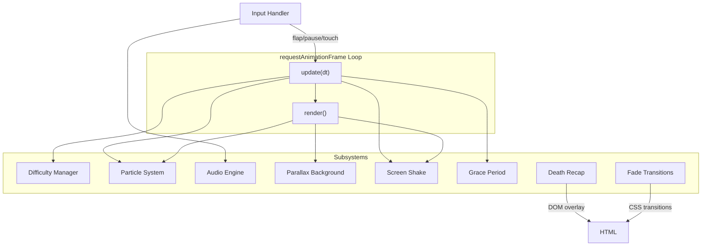
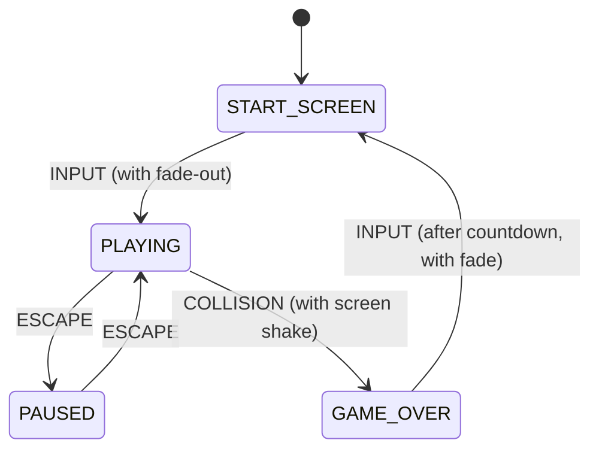

# Design Document: Game Polish

## Overview

This design adds 15 game-feel enhancements to Flappy Kiro, all implemented within the existing single-file vanilla JS architecture (`app.js`, `index.html`, `style.css`). The enhancements span four categories:

1. **Gameplay Mechanics** — Progressive difficulty, grace period, pause, death recap
2. **Visual Effects** — Screen shake, particles, velocity rotation, pipe caps, parallax background, score popup, fade transitions
3. **Audio** — Procedural sound engine (flap, crash, score ping, steering whoosh, background hum)
4. **Input** — Mobile touch support

All rendering uses Canvas 2D. All audio uses Web Audio API procedural synthesis (no new asset files). UI overlays use DOM elements positioned over the canvas. The game loop remains a single `requestAnimationFrame` cycle with strict `update(dt) → render()` separation.

## Architecture

The existing architecture is a single game loop with a state machine (`START_SCREEN`, `PLAYING`, `GAME_OVER`). This design extends it with:

- A new `PAUSED` state added to the state machine
- A **Difficulty Manager** module that adjusts pipe speed and gap based on score
- A **Particle System** that maintains an array of active particles rendered each frame
- A **Procedural Audio Engine** built on a single shared `AudioContext`
- A **Parallax Background** renderer with two scrolling layers
- A **Screen Shake Controller** that offsets the canvas origin temporarily
- A **Grace Period Controller** managing early-game invincibility
- A **Death Recap Controller** managing the post-death overlay and countdown
- A **Fade Transition Controller** managing opacity animations on DOM overlays



### State Machine Extension



## Components and Interfaces

### 1. Difficulty Manager

Adjusts pipe speed and gap size based on current score.

```javascript
// Pure function: calculates current difficulty parameters
function getDifficultyParams(score) → { pipeSpeed, pipeGap }
// Pure function: resets to base values
function getBaseDifficulty() → { pipeSpeed: PIPE_SPEED, pipeGap: PIPE_GAP }
```

**Constants:**
- `DIFFICULTY_STEP = 5` — score interval for difficulty increase
- `SPEED_INCREMENT = 0.3` — pipe speed increase per step
- `GAP_DECREMENT = 5` — gap size decrease per step
- `MIN_GAP = 100` — minimum allowed gap
- `MAX_PIPE_SPEED = 6` — maximum allowed pipe speed

### 2. Screen Shake Controller

Manages a time-limited random offset applied to the canvas rendering origin.

```javascript
function activateScreenShake() → shakeState
function updateScreenShake(shakeState, dt) → shakeState
function getShakeOffset(shakeState) → { offsetX, offsetY }
```

**Constants:**
- `SHAKE_DURATION = 300` — milliseconds
- `SHAKE_INTENSITY = 5` — max pixel offset in any direction

### 3. Grace Period Controller

Manages the initial invincibility window.

```javascript
function activateGracePeriod() → graceState
function updateGracePeriod(graceState, dt) → graceState
function isGracePeriodActive(graceState) → boolean
function getGraceOpacity(graceState) → number // for flashing effect
```

**Constants:**
- `GRACE_DURATION = 1500` — milliseconds
- `GRACE_FLASH_RATE = 150` — milliseconds per flash cycle

### 4. Particle System

Manages creation, update, and rendering of short-lived particles.

```javascript
function spawnParticles(x, y, count, config) → particle[]
function updateParticles(particles, dt) → particle[]  // removes dead ones
function renderParticles(ctx, particles) → void
```

**Particle structure:**
```javascript
{ x, y, vx, vy, radius, color, alpha, life, maxLife }
```

### 5. Rotation Renderer

Applies velocity-based angular rotation to the player sprite.

```javascript
function calculateRotation(velocity) → angleDegrees  // clamped -30 to +60
function renderRotatedSprite(ctx, image, x, y, width, height, angleDeg) → void
```

### 6. Pipe Cap Renderer

Draws wider cap rectangles at pipe openings.

```javascript
function renderPipeWithCaps(ctx, pipe, canvasHeight) → void
```

**Constants:**
- `CAP_OVERHANG = 6` — extra pixels on each side
- `CAP_HEIGHT = 20` — cap rectangle height

### 7. Parallax Background

Two-layer scrolling background with speed ratios relative to pipe speed.

```javascript
function initParallaxLayers(canvasWidth, canvasHeight) → layers
function updateParallaxLayers(layers, pipeSpeed, dt) → layers
function renderParallaxLayers(ctx, layers, canvasWidth, canvasHeight) → void
```

**Layer config:**
- Back layer: stars/dots at 20% pipe speed
- Front layer: grid lines at 50% pipe speed

### 8. Score Popup

DOM-based floating "+1" animation.

```javascript
function createScorePopup(playerX, playerY) → void  // creates DOM element with CSS animation
```

**Constants:**
- `POPUP_DURATION = 800` — milliseconds for float + fade

### 9. Procedural Audio Engine

Single `AudioContext` with methods for each sound effect.

```javascript
function createProceduralAudioEngine() → {
  playFlap(),
  playCrash(),
  playScorePing(),
  playSteeringWhoosh(),
  startBackgroundHum(),
  stopBackgroundHum()
}
```

**Sound specifications:**
- Flap: sine wave, 300→500Hz sweep, 80ms, quick attack/decay envelope
- Crash: sawtooth wave, 400→100Hz sweep, 300ms, sharp attack/longer decay
- Score ping: sine wave, 800Hz, 60ms, quick attack/decay
- Steering whoosh: sawtooth wave, 200→1200Hz sweep, 200ms, rapid fade-out
- Background hum: sine wave, 60Hz, gain pulsing 5-10%, continuous during PLAYING

### 10. Touch Input Handler

Extends existing input system with touch events.

```javascript
function setupTouchHandlers(canvas, onInput) → void
```

- Listens to `touchstart` on canvas
- Calls `preventDefault()` to suppress scroll/zoom
- Steering button sized ≥ 44×44px for accessibility

### 11. Pause Controller

Manages the PAUSED state and overlay.

```javascript
function togglePause(gameContext) → gameContext
function renderPauseOverlay(visible) → void  // DOM show/hide
```

### 12. Death Recap Controller

Manages post-death overlay with countdown.

```javascript
function showDeathRecap(score, highScore, isNewHighScore) → void
function updateDeathRecapCountdown(dt) → { countdownDone: boolean }
function hideDeathRecap() → void
```

**Constants:**
- `RECAP_COUNTDOWN = 3` — seconds before restart enabled

### 13. Fade Transition Controller

CSS-based opacity transitions on DOM overlays.

```javascript
function fadeOut(element, durationMs) → Promise
function fadeIn(element, durationMs) → Promise
function setTransitionLock(locked) → void  // prevents input during transition
```

**Constants:**
- `FADE_DURATION = 400` — milliseconds

## Data Models

### Extended Game Context

```javascript
gameContext = {
  // Existing fields
  state: GameState,          // now includes PAUSED
  player: { x, y, velocity },
  pipes: [],
  dataPackets: [],
  score: number,
  highScore: number,
  frameCount: number,
  steeringCharge: number,
  steeringModeActive: boolean,
  steeringModeTimer: number,

  // New fields
  paused: boolean,
  gracePeriod: { active: boolean, timer: number },
  screenShake: { active: boolean, timer: number, offsetX: number, offsetY: number },
  particles: [],
  parallaxLayers: { back: { offset: number }, front: { offset: number } },
  deathRecap: { active: boolean, countdown: number, inputEnabled: boolean },
  transitionLock: boolean,   // prevents input during fades
  currentDifficulty: { pipeSpeed: number, pipeGap: number }
}
```

### Extended GameState Enum

```javascript
const GameState = {
  START_SCREEN: 'START_SCREEN',
  PLAYING: 'PLAYING',
  PAUSED: 'PAUSED',
  GAME_OVER: 'GAME_OVER'
};
```

### Particle Data Model

```javascript
{
  x: number,        // current x position
  y: number,        // current y position
  vx: number,       // horizontal velocity (px/s)
  vy: number,       // vertical velocity (px/s)
  radius: number,   // 2-4 pixels
  color: string,    // purple hex
  alpha: number,    // current opacity 0-1
  life: number,     // remaining life (ms)
  maxLife: number   // total lifespan (ms)
}
```

### Parallax Layer Data Model

```javascript
{
  back: {
    offset: number,           // current scroll offset
    speedRatio: 0.2,          // 20% of pipe speed
    elements: [{ x, y, size }]  // star positions
  },
  front: {
    offset: number,
    speedRatio: 0.5,          // 50% of pipe speed
    elements: [{ x, y }]     // grid line positions
  }
}
```

### Pipe Cap Collision Geometry

The pipe cap extends the collision rect:
```javascript
// Top pipe cap: at bottom of top pipe
{ x: pipe.x - CAP_OVERHANG, y: pipe.gapTop - CAP_HEIGHT, width: pipe.width + CAP_OVERHANG * 2, height: CAP_HEIGHT }
// Bottom pipe cap: at top of bottom pipe
{ x: pipe.x - CAP_OVERHANG, y: pipe.gapBottom, width: pipe.width + CAP_OVERHANG * 2, height: CAP_HEIGHT }
```


## Correctness Properties

*A property is a characteristic or behavior that should hold true across all valid executions of a system — essentially, a formal statement about what the system should do. Properties serve as the bridge between human-readable specifications and machine-verifiable correctness guarantees.*

### Property 1: Difficulty parameters are bounded and monotonic

*For any* score value (0 to any positive integer), `getDifficultyParams(score)` SHALL return a pipe speed in the range `[PIPE_SPEED, MAX_PIPE_SPEED]` (i.e., `[3, 6]`) and a pipe gap in the range `[MIN_GAP, PIPE_GAP]` (i.e., `[100, 150]`), with speed non-decreasing and gap non-increasing as score increases.

**Validates: Requirements 1.1, 1.2, 1.3, 1.4**

### Property 2: Screen shake offset is bounded and expires correctly

*For any* screen shake state, `getShakeOffset(shakeState)` SHALL return offsets where both `offsetX` and `offsetY` are in the range `[-SHAKE_INTENSITY, +SHAKE_INTENSITY]` (i.e., `[-5, +5]`). Furthermore, for any shake state where the timer has been advanced by a total elapsed time ≥ `SHAKE_DURATION` (300ms), the offsets SHALL be exactly `(0, 0)` and the shake SHALL be inactive.

**Validates: Requirements 2.2, 2.3**

### Property 3: Grace period suppresses pipe collision but preserves boundary collision

*For any* player rectangle and any set of pipes, while the grace period is active, `checkCollision` with `isGracePeriodActive = true` SHALL return `false` for pipe overlaps. However, for any player position where `y <= 0` or `y + height >= canvasHeight`, collision SHALL return `true` regardless of grace period state.

**Validates: Requirements 3.2, 3.5**

### Property 4: Grace period opacity alternates between two values

*For any* grace period timer value > 0, `getGraceOpacity(timer)` SHALL return either `1.0` or `0.5`, alternating at a period defined by `GRACE_FLASH_RATE` (150ms). The function output is deterministic given the timer value.

**Validates: Requirements 3.3**

### Property 5: Spawned particles satisfy all invariants

*For any* (x, y) spawn position, `spawnParticles(x, y)` SHALL return between 8 and 12 particles (inclusive), where each particle has: initial position equal to (x, y), radius in `[2, 4]`, lifespan (`maxLife`) in `[400, 600]` milliseconds, a purple color value, and non-zero velocity (vx² + vy² > 0).

**Validates: Requirements 4.1, 4.2, 4.5**

### Property 6: Particle update advances position, decays alpha, and removes expired particles

*For any* array of particles and any positive delta time `dt`, `updateParticles(particles, dt)` SHALL return particles where: each surviving particle's position has advanced by `(vx * dt, vy * dt)`, each surviving particle's alpha equals `max(0, remainingLife / maxLife)`, and no particle with `life <= 0` remains in the output array.

**Validates: Requirements 4.3, 4.4**

### Property 7: Rotation angle is clamped and direction-correlated

*For any* vertical velocity value, `calculateRotation(velocity)` SHALL return an angle in the range `[-30, +60]` degrees. Additionally, when velocity < 0 the angle SHALL be ≤ 0, when velocity > 0 the angle SHALL be ≥ 0, and when velocity = 0 the angle SHALL be 0.

**Validates: Requirements 5.1, 5.2, 5.3, 5.4**

### Property 8: Pipe cap geometry is included in collision detection

*For any* player rectangle that overlaps a pipe cap rectangle (extending `CAP_OVERHANG` pixels beyond pipe body on each side, `CAP_HEIGHT` pixels tall at pipe openings) but does NOT overlap the pipe body rectangle, collision detection SHALL return `true`.

**Validates: Requirements 6.4**

### Property 9: Parallax layers scroll at correct speed ratios

*For any* current pipe speed and any positive delta time `dt`, updating the parallax layers SHALL advance the back layer offset by `pipeSpeed * 0.2 * dt` and the front layer offset by `pipeSpeed * 0.5 * dt`.

**Validates: Requirements 7.1, 7.2**

### Property 10: Parallax layers wrap seamlessly

*For any* parallax layer state after any number of updates with any positive delta times, the layer offset SHALL remain in the range `[0, layerContentWidth)` — wrapping around when it exceeds the content width.

**Validates: Requirements 7.3**

### Property 11: Pause state halts all game updates

*For any* game context in the PAUSED state and any positive delta time `dt`, calling the update function SHALL not modify player position, player velocity, pipe positions, score, steering charge, steering timer, grace period timer, or frame count.

**Validates: Requirements 13.2**

### Property 12: Input is blocked during countdown and transitions

*For any* game context where either the death recap countdown is > 0 OR the transition lock is active, triggering an input event SHALL not change the game state (no state transitions occur).

**Validates: Requirements 14.3, 15.5**

## Error Handling

### Audio Context Restrictions

- The `AudioContext` must be created lazily on first user interaction (click, touch, keydown) to comply with browser autoplay policies.
- All `OscillatorNode.start()` and `GainNode` operations are wrapped in try/catch to silently handle suspended audio contexts.
- If the AudioContext is in `suspended` state, call `audioContext.resume()` before playing sounds.

### Sprite Load Failure

- Existing fallback already renders a purple rectangle if `ghosty.png` fails to load.
- Rotation rendering must apply the same fallback: rotate a purple rectangle instead of the sprite.

### Touch Event Compatibility

- Touch handlers check for `TouchEvent` support before registering to avoid errors on desktop browsers without touch API.
- `passive: false` is passed to `addEventListener` for `touchstart` to allow `preventDefault()`.

### DOM Element Safety

- All DOM element lookups (pause overlay, death recap, score popup) use `getElementById` with null checks before manipulation.
- Score popup elements are cleaned up via `animationend` event listener to prevent DOM node accumulation.

### Frame Rate Independence

- All time-based calculations (shake timer, grace timer, particle life, parallax scroll, countdown) use `deltaMs` from `requestAnimationFrame` timestamps.
- A delta time cap of 100ms prevents physics explosions after tab-switch or long pauses.

## Testing Strategy

### Property-Based Tests (fast-check)

The project will use [fast-check](https://github.com/dubzzz/fast-check) for property-based testing. Each correctness property maps to a single property-based test running a minimum of 100 iterations.

**Test Configuration:**
- Library: fast-check (JavaScript PBT library)
- Minimum iterations: 100 per property
- Tag format: `Feature: game-polish, Property N: <title>`

**Properties to test:**
1. Difficulty bounds and monotonicity
2. Screen shake offset bounds and expiration
3. Grace period collision behavior
4. Grace opacity alternation
5. Particle spawn invariants
6. Particle lifecycle update
7. Rotation clamping and direction correlation
8. Pipe cap collision geometry
9. Parallax speed ratios
10. Parallax layer wrapping
11. Pause halts updates
12. Input blocking during countdown/transition

### Unit Tests (Example-Based)

Example-based tests cover specific scenarios, state transitions, and integration points:

- Difficulty resets on game restart (Req 1.5)
- Screen shake activates on collision (Req 2.1)
- Grace period activates on game start (Req 3.1)
- Score popup DOM creation and removal (Req 8.1-8.4)
- Pause state toggle via Escape key (Req 13.1, 13.4)
- Death recap displays score/high score (Req 14.1, 14.2, 14.4, 14.5)
- Fade transitions apply CSS properties (Req 15.1-15.4)
- Touch input triggers same handler as Space (Req 12.1-12.4)

### Integration Tests

Audio engine tests verify Web Audio API integration:
- AudioContext singleton creation (Req 9.4)
- Oscillator configuration for each sound type (Req 9.1-9.3, 10.1-10.2)
- GainNode envelope shaping (Req 9.5)
- Background hum start/stop lifecycle (Req 11.1-11.3)

These use a mocked AudioContext to verify node creation and parameter values without producing actual audio output.

### Test File Structure

```
tests/
  game-polish.property.test.js   — All 12 property-based tests
  game-polish.unit.test.js       — Example-based unit tests
  game-polish.audio.test.js      — Audio engine integration tests (mocked AudioContext)
```
