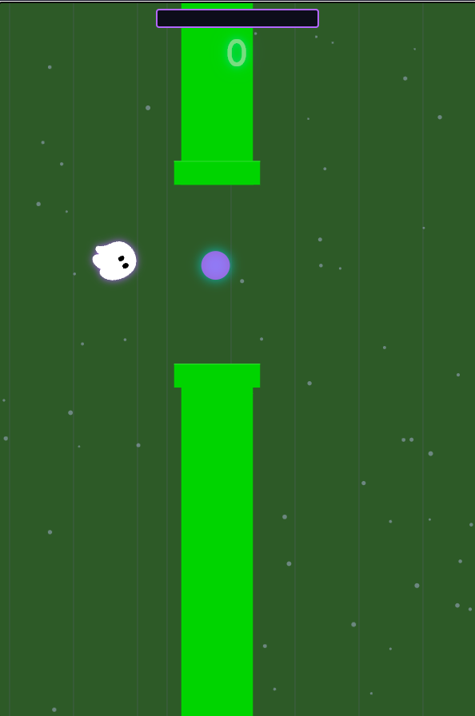

# Flappy Kiro

> A retro-neon Flappy Bird game built with vanilla JavaScript, HTML5 Canvas, and Web Audio API.

<p align="center">
  
</p>

## Play Now

**[https://kxnn02.github.io/flappy-kiro/](https://kxnn02.github.io/flappy-kiro/)**

---

## About

Flappy Kiro features Ghosty, a neon-purple spirit navigating through pipes in a dark retro world. Collect Data Packets to charge Steering Mode, grab power-ups, and chase your high score. Everything runs in the browser with zero dependencies.

---

## Controls

| Input | Action |
|-------|--------|
| Space / Click / Touch | Flap |
| Escape | Pause / Resume |
| Shift | Activate Steering Mode |

---

## Features

**Gameplay**
- Steering Mode — Collect Data Packets to charge autopilot with invincibility
- Power-ups — Shield (absorbs one hit), Magnet (attracts Data Packets)
- Difficulty scaling — Pipe speed increases and gap shrinks as you score

**Visuals**
- Refined dark-neon color palette with CSS custom properties
- Multi-layer glow effects on buttons, headings, and canvas entities
- Smooth overlay transitions with fade and slide animations
- Scrolling grid background with vertical gradient
- Day/Night cycle and themed worlds that change every 50 points
- Trail effect and death spin animation
- Score pulse animation on increment

**Audio**
- Ambient lo-fi music engine — Procedural warm chord pads via Web Audio API
- Chiptune melody layer with pentatonic bass line
- Procedural sound effects (flap, score, crash, steering whoosh)

**Technical**
- Single-file architecture (index.html, style.css, app.js)
- Object pooling for particles and pipes (zero-allocation gameplay)
- Responsive canvas scaling (2:3 aspect ratio, any viewport)
- Frame-rate independent physics and pipe spawning
- PWA support with offline caching

**Accessibility**
- Reduced motion support (disables all animations and transitions)
- ARIA labels on canvas for screen readers
- Keyboard-focusable controls with visible focus indicators

---

## Getting Started

The game is a static single-page app — no build step needed.

```bash
# Option 1: Open directly
open index.html

# Option 2: Local server (recommended)
npx serve .
# Then visit http://localhost:3000
```

---

## Running Tests

Property-based tests validate core game logic:

```bash
npm install
npm test
```

---

## Project Structure

```
├── index.html          # Game page with canvas and UI overlays
├── style.css           # Palette, transitions, glows, and layout
├── app.js              # All game logic (single-file architecture)
├── assets/
│   ├── ghosty.png      # Ghosty sprite
│   ├── screenshot.png  # Gameplay screenshot
│   ├── jump.wav        # Flap sound effect
│   └── game_over.wav   # Death sound effect
├── tests/              # Property-based tests (vitest + fast-check)
├── manifest.json       # PWA manifest
└── service-worker.js   # Offline caching
```

---

## Deployment

Deployed to GitHub Pages via GitHub Actions. Every push to `main` triggers automatic deployment.

---

## License

See [LICENCE.md](LICENCE.md) for details.
